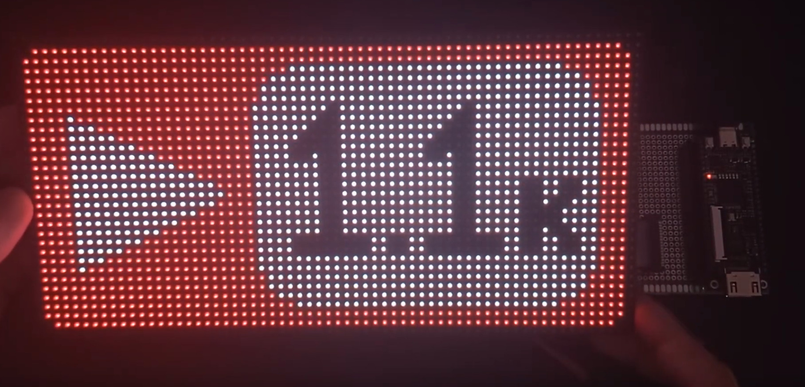

# Tang75

Tang75 is a HUB75 Display Driver written in Verilog for [Sipeed Tang Nano 9k](https://wiki.sipeed.com/hardware/en/tang/Tang-Nano-9K/Nano-9K.html)



You can find an [Educational Article in Lushay Labs](https://learn.lushaylabs.com/p/21ec19ed-77c6-46bc-86c4-455878bce993) written in a didactical way for a better explanation about how the driver works.

The article was split in two parts:

- **01**: Single Red Pixel Top Right Corner
- **02**: Static Image

## Build Instructions

```bash
# Select Lesson
cd 01
# build
make
# flash into FPGA (needs openFPGALoader)
make flash
```

## Wiring

Check [wiring.md](docs/wiring.md) in docs folder.

## Requirements

- [Sipeed Tang Nano 9k]((https://wiki.sipeed.com/hardware/en/tang/Tang-Nano-9K/Nano-9K.html))
- [HUB75 Matrix LED Display](https://aliexpress.com/item/1005004050147773.html)
- [Verilator](https://github.com/verilator/verilator) (optional, for simulation purposes)
- [GNU Make](https://www.gnu.org/software/make/) to build the bitstream
- [Gowin-Nextpnr](https://github.com/YosysHQ/nextpnr) to Place and Route tool
- [Yosys](https://github.com/YosysHQ/yosys) to Verilog Interpreter
- [GTKWave](https://github.com/gtkwave/gtkwave) (optional, for .vcd file reading)
- [openFPGALoader](https://github.com/trabucayre/openFPGALoader) (optional, to flash the bitstream into th FPGA)

## Display Specs

The HUB75 display used in source code has these technical specifications:

- 64 pixels by 32 pixels display
- 1/16 scan
- 256mm x 128mm size
- Address lines are pins A, B, C and D

The Source Code can be tweaked to meet your display specs, feel free to add it to your design!

## Simulate

Use [verilator](https://github.com/verilator/verilator) to simulate waveform by running:

```
make sim
```

the output will be a `.vcd` file, which can be read in [GTKWave](https://github.com/gtkwave/gtkwave).

## TO DO

- [ ] Implement the Framebuffer using BRAM